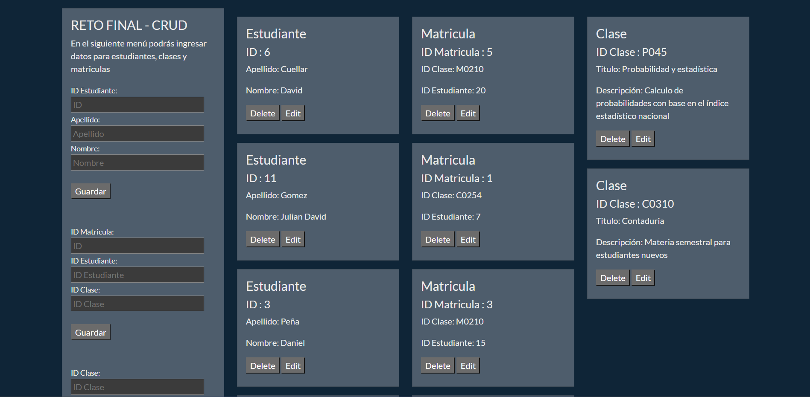
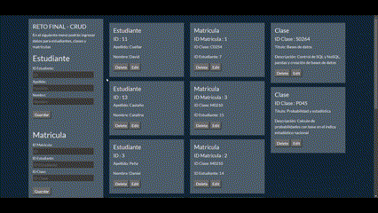
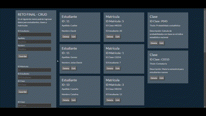

# Daniel_AlfonsoPQ.github.io

<h2 style="text-align: center;"><strong>Reto Final - CRUD</strong></h2>

<strong>CRUD diseñada con JavaScript y HTML para añadir estudiantes, matriculas y clases con la base de datos de Firebase. </strong>

<strong></strong>

<strong>Menú de la interfaz principal. En la parte izquierda hay un formulario para llenar los datos de estudiantes, clases y matriculas</strong>

<strong></strong>

Registramos los datos de una clase a la base de datos

<strong>Editamos los registros</strong>

<strong></strong>

Modificamos el ID de un estudiante

<strong>Eliminar registro</strong>

<strong></strong>

Con darle al botón de "Delete" se elimina inmediatamente de la base de datos y de los registros que se muestran en la página

<strong>Todos los cambios que se hacen en la página se van actulizando en la base de datos de Firebase</strong>

<strong></strong>

